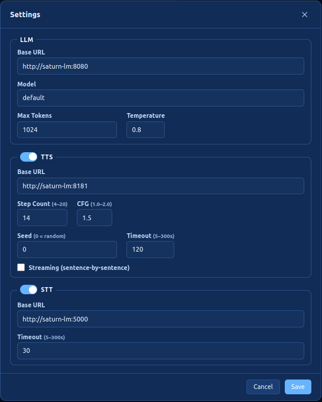
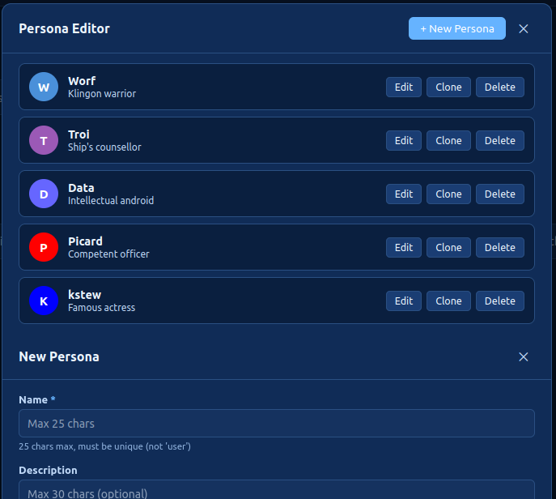
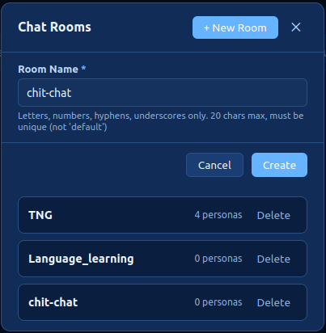
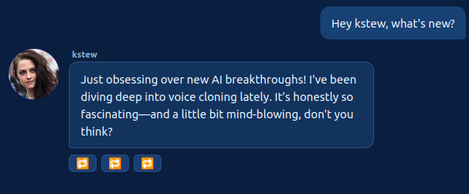

# TalkWithMe

A local single-user chat web application that connects to a locally running **llama.cpp** server and supports **multi-persona group chats** with optional **TTS playback**.


Follow the development of this app on my YouTube channel:

- Initial creation: https://www.youtube.com/watch?v=1VPydYNt4R8
- Multi-lingual voice cloning: https://www.youtube.com/watch?v=1yiyFYaUlU4
- Better TTS support: https://www.youtube.com/watch?v=jDudeaWppSE
- MCP integrations: (coming soon!)

## Features

- Chat with one or more AI personas in a simulated group chat
- Set up chat rooms and assign personas to them
- Smart persona routing: let the LLM decide, pick randomly, or choose manually
- Optional TTS: AI responses spoken aloud via a TTS server
- Optional STT: Click the microphone icon to speak your prompt
- Fully local — no internet required, no authentication
- Theme chooser in the top-right: Dark (default), Light, Matrix, and Blues
- Each room persists its text and audio messages

## Prerequisites

- Python 3.10+
- A locally running llama.cpp server with OpenAI-compatible API (e.g., `--api` flag)
- (Optional) A local TTS REST server with `/synthesize` and `/health` endpoints.
   You can use my [dots.tts server.py](https://github.com/scorbo2/ai-playground/blob/master/dots.tts/server.py)
   in front of a [dots.tts](https://github.com/studio-dots-ai/dots.tts) server.
   Alternatively, you can use my [Qwen3-TTS server.py](https://github.com/scorbo2/ai-playground/blob/master/qwen3-tts/server.py)
   running in front of a [Qwen3-TTS](https://github.com/QwenLM/Qwen3-TTS) server. I've tested both successfully.
- (Optional) An OpenAI-compatible STT server that exposes a `/v1/audio/transcriptions` endpoint
   accepting multipart form uploads. The `stt.base_url` in `settings.yaml` should point to the
   server's root (e.g., `http://localhost:8181`), and the app will POST to
   `{base_url}/v1/audio/transcriptions`. I strongly recommend [whisper-fastapi](https://github.com/heimoshuiyu/whisper-fastapi)
   as it is very easy to get up and running (and it is in fact what I use with this app).

## Quick Start

```bash
# Install dependencies
pip install -r requirements.txt

# Run the app
uvicorn app.main:app --host 0.0.0.0 --port 8000 --reload
```

Open `http://localhost:8000` in your browser.

## Configuration

Most settings can be changed in the UI. Behind the scenes, configuration is stored on disk:

- `settings.yaml` stores LLM, TTS, and STT server endpoints
- `chatrooms.yaml` stores configured chat rooms (if any)
- `personas.yaml` stores all personas

### Server settings

The UI offers a "Settings" control in the top right, which brings up the server settings dialog:



The `settings.yaml` file on disk persists these settings:

```yaml
llm:
  base_url: http://localhost:8080
  model: "default"
  max_tokens: 1024
  temperature: 0.8

tts:
  enabled: true
  base_url: http://localhost:5500
  num_steps: 10
  guidance_scale: 3.0
  seed: null
  timeout: 60
  streaming: false

stt:
  enabled: true
  base_url: http://localhost:8181
  timeout: 30

general:
  persona_name_mentions: true
```

Note that TTS and STT are both optional! You can mark them as disabled
and/or leave the base_url field blank or null. The only mandatory
configuration here is the LLM.

### Personas

Select the "Personas" control in the top right to bring up the Personas editor:



In this editor, you can:

- **Create** a new persona with the **+ New Persona** button
- **Edit** any existing persona's properties inline
- **Clone** a persona (a numeric suffix is added to the name, e.g. `Mark_2`)
- **Delete** a persona (with a confirmation prompt)

Changes are persisted immediately to `personas.yaml` and the sidebar persona list is refreshed automatically. No server restart is needed.

> **Note**: renaming or deleting a persona does not modify messages already visible in the chat panel — those retain the name they were created with.

The `personas.yaml` file persists these settings:

```yaml
personas:
  - name: "Alex"
    description: "A curious and friendly AI assistant"
    system_prompt: "You are Alex, a curious and friendly AI."
    router_hints: "general questions, science, math, history"
    avatar_color: "#4A90D9"
    avatar_image: null
    reference_audio: null
    reference_audio_transcript: null
    reference_audio_language: "en"
```

(Note that the `reference_audio_language` field does not control what language the persona speaks. It refers
specifically to the language of the supplied reference audio, if any, so that voice cloning
can be more accurate)

#### Persona fields

| Field | Description |
|-------|-------------|
| `name` | Unique persona name |
| `description` | Short description shown in the sidebar |
| `system_prompt` | System prompt sent to the LLM for this persona |
| `router_hints` | Keywords the router uses to pick this persona |
| `avatar_color` | Hex color for the avatar circle fallback |
| `avatar_image` | Path to a local image file (optional) |
| `reference_audio` | Path to a WAV file for TTS voice cloning (optional) |
| `reference_audio_transcript` | Path to a TXT file with the audio transcript (required with `reference_audio`) |
| `reference_audio_language` | Two-letter language code describing the reference audio (defaults to `en`) |

**TTS support**: Both `reference_audio` and `reference_audio_transcript` must be set for a persona to have TTS capability.

#### Who answers next?

The "Who should answer?" chooser in the UI offers the following options:
- **LLM decides** - based on your prompt, and the personas currently in the room, the LLM will decide who is best suited to answer.
- **Surprise me** - each prompt causes a randomly-selected persona in the current room to answer.
- **Selected persona** - the highlighted persona in the persona list will answer next.

Note that if `persona_name_mentions` is `true` in `settings.yaml`, mentioning a specific persona in your prompt will override
the above settings and force that persona to answer you. For example, prompting "What do you think, Alex?" will automatically
switch "Who should answer?" to "Selected persona", and make Alex the selected persona, before proceeding with the chat flow.
If you don't like this feature, you can set `persona_name_mentions` to `false` and restart the application. (There is currently
no UI control over this setting - it has to be hand-edited in `settings.yaml` and is only read once on startup).

### Chat rooms

Selecting the "Chat rooms" control in the top right brings up the chat room editor:



Here, you can:

- **Create** a new chat room (names must be unique)
- **Delete** a chat room (and its chat history)

The `chatrooms.yaml` file persists these settings:

```yaml
chat_rooms:
- name: TNG
  persona_names:
  - Worf
  - Troi
  - Data
  - Picard
- name: Language_learning
  persona_names:
  - English expert
  - German expert
  - Spanish expert
- name: chit-chat
  persona_names:
  - kstew
```

Personas can be added/removed to a chat room via the main chat interface's left panel:


The "Chat room" control at the top allows you to switch chat rooms. The messages in the current
chat room are persisted, so you can come back later without losing anything.

Select "Add persona" to add personas to the current room.

Click the red "x" control next to a persona in the list to unassign them from this room.
This does not delete the persona - they are still available to be assigned to other rooms.
A persona can be assigned to any number of rooms simultaneously.

## API Endpoints and project structure

Moved to [copilot-instructions.md](.github/copilot-instructions.md)

## Cloning non-English voices

If your reference audio is in English, you're all set.

If your reference audio is in some other language, you must specify the language code in the `reference_audio_language` field for the persona in question. This helps the voice cloner understand the reference audio. This may also prevent the cloned voice from speaking in languages other than the reference audio language, but your mileage may vary.

## Streaming TTS responses

If `streaming` is enabled in the TTS configuration, text responses from AI personas will be chunked into sentences using common punctuation, and each sentence will be queued up as a separate TTS request. A separate audio playback queue is used to queue up and play the responses sequentially. 

- Advantage: the initial lag time before playback begins is reduced. The user only has to wait for the first sentence to generate and not the entire text response. As each sentence plays, the next sentence is being processed by the TTS service. Ideally, the lag between sentences is minimal.
- Disadvantage: sentence length variance can lead to large pauses between sentences. A short sentence followed by a long sentence is the worst case scenario, because the short sentence will process and play very quickly, but the longer sentence will take much longer for the TTS server to process.

If you prefer to hear the persona's response in one clear, contiguous audio playback, and you don't mind the lag time for audio playback to begin, leave streaming mode disabled in configuration (this is the default).

If you want to hear each sentence as soon as it has been synthesized, without having to wait for the ENTIRE response to be synthesized, and you don't mind the occasional pause in between sentences, then enable streaming mode in configuration.

## Chat persistence

Each chat room persists its chat history to a dedicated subdirectory in the top-level `chatrooms` directory.
For example, a chat room named `chit-chat` will persist to `<projectDir>/chatrooms/chit-chat`. All text and
audio are saved there. If the history gets too long, you may overflow the context limit of the LLM. You can
select "New Chat" at any time to clear the chat history and start over. 

Each chat room persists separately! Selecting "New Chat" in the `chit-chat-1` room will not clear the
history in the `chit-chat-2` room, and vice versa.

## Replaying audio

A small "replay" icon will appear underneath messages that have audio associated with them. This applies both
to persona-generated messages that were sent to the TTS server, and also user-supplied microphone input.
Clicking this "replay" button will replay the audio for that message. 

In non-streaming mode, a single "replay" button will be shown underneath each persona message:


In streaming mode, there will be one replay icon per sentence in the response. Clicking each button
will play the respective sentence:



## Detailed setup guide

I have tested this application against `llama-server` running on a local server.
Security and authentication were **not** considered, as the intent is for everything
to run on a secure local network. Other LLM providers such as LMStudio should also
work, if they provide an OpenAI-compatible API.

Because both TTS and STT are optional, you have several options for running the
application, depending on how much VRAM you can throw at it.

### Minimal setup (~4GB VRAM)

- Recommended LLM: Gemma 4 E4B Q4
- Recommended TTS: (disabled)
- Recommended STT: `whisper-fastapi`, any model, running on CPU (not on cuda!)

### Modest setup (~12GB VRAM)

- Recommended LLM: Gemma 4 E4B Q4
- Recommended TTS: `Qwen3-TTS`
- Recommended STT: `whisper-fastapi`, small model, running on CPU or cuda

### Large setup (~16GB VRAM)

- Recommended LLM: Gemma 4 E4B Q6
- Recommended TTS: Either `Qwen3-TTS` or `dots.tts`
- Recommended STT: `whisper-fastapi`, large-v3-turbo, running on cuda

### X-Large setup (24GB or higher)

- Recommended LLM: Gemma 4 26B A4B
- Recommended TTS: Either `Qwen3-TTS` or `dots.tts`
- Recommended STT: `whisper-fastapi`, large-v3-turbo, running on cuda

## Release history

- **2026-07-27** v1.0
  - initial release
  - basic text input only
  - manual configuration of personas
  - optional TTS
- **2026-07-29** v2.0
  - Add multi-language support (#1)
  - Add streaming TTS audio output option (#2)
  - Better size and positioning of avatar images (#3)
  - Allow microphone voice input for prompting (#6)
  - Color theme chooser with persistence (#12)
- **2026-08-02** v3.0
  - In-app persona editor: create, edit, clone, and delete personas from the browser UI (#11)
  - Migrate STT to OpenAI-compatible `/v1/audio/transcriptions` endpoint (#21)
  - Split TTS and STT into separate features with separate configuration (#19)
  - Add UI for server connection settings (#23)
  - Clicking a persona now updates "Who should answer?" to "Selected persona" (#24)
  - Added configurable chat rooms for grouping personas (#18)
  - Mentioning a persona causes them to answer next (can be disabled in settings.yaml) (#28)
  - Break up the `app.js` monolith for code maintainability (#29)
  - Chat persistence (#4)
  - Save generated audio and allow replay (#5)
  - Add screenshots and better setup guidance to README (#17)
  - Add read-only "server type" field in TTS server settings (Qwen3-TTS or dots.tts) (#36)
- **TODO All release notes for v4 go here**
  - Relax chat room name restrictions to allow spaces (#45)
  - Rename `language` to `reference_audio_language` in persona config (#46)

## License

This project is licensed under the [MIT License](LICENSE)

